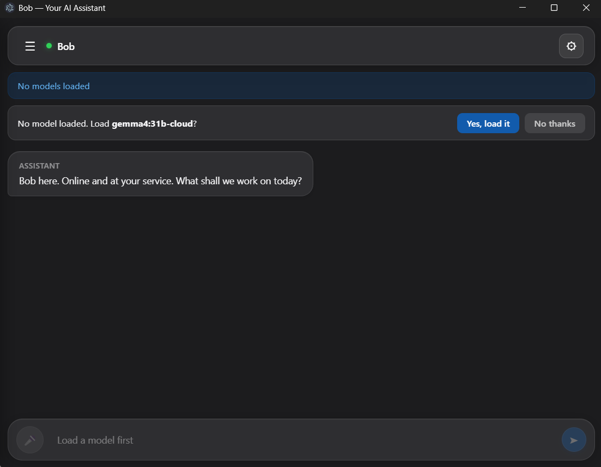
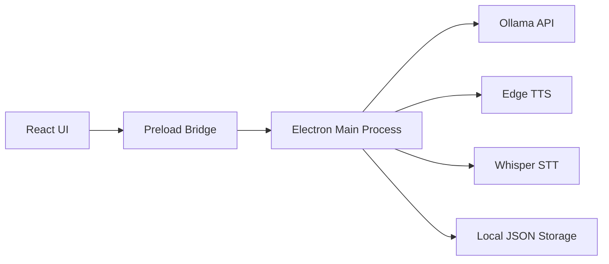

# Bob AI Assistant

Bob AI Assistant is a desktop, local-first AI companion built with Electron, React, Vite, and Ollama. It combines a modern conversational UI with voice input/output, persistent chat sessions, and a memory layer that can recall facts, goals, stories, and preferences from prior conversations.

The application is designed to run mostly on the user's machine. It uses local models through Ollama, local speech-to-text via Whisper, and Microsoft Edge TTS for voice output, so it can work without sending sensitive conversations to external APIs.

---

## 1. Overview

Bob AI Assistant is a personal productivity and chat assistant with the following goals:

- Provide a desktop experience for chatting with a local AI model
- Support voice input and voice output for a more natural interaction
- Preserve conversations across sessions
- Build a lightweight memory system that improves continuity over time
- Package the app as a Windows desktop installer for easy distribution

---

## 2. Main Features

- Local AI chat using Ollama
- Voice input using microphone recording and Whisper-based transcription
- Voice output using system voices or Microsoft Edge TTS
- Session-based chat history with rename/delete support
- Personality customization commands such as /name, /tone, /style, and /set
- Memory extraction from conversations for facts, goals, preferences, and stories
- Desktop packaging via Electron Builder for Windows

---

## 3. Screenshots



**Main UI Overview:**
- Left sidebar with session history and new chat creation
- Central chat area showing messages and AI responses
- Model selector and voice controls in the top bar
- Input field with voice and send options at the bottom

---

## 4. Technology Stack

- Frontend: React + Vite
- Desktop shell: Electron
- Backend/LLM integration: Ollama REST API
- Speech-to-text: Whisper via @xenova/transformers
- Text-to-speech: Edge TTS via node-edge-tts
- Build tool: Electron Builder
- Runtime: Node.js

---

## 5. Architecture

The app follows a split-process desktop architecture:



### High-level layers

1. Presentation layer
   - The React UI in src renders the chat interface, voice controls, model selection, and settings.

2. Electron host layer
   - The main process in electron/main.js controls the application window, IPC handlers, voice services, and local file storage.

3. Integration layer
   - The app talks to Ollama for chat generation, Whisper for transcription, and Edge TTS for speech synthesis.

4. Persistence layer
   - Sessions and memory are stored locally in the user's application data folder as JSON files.

---

## 6. System Design

### 5.1 Client-Server Model

The application is not a traditional web app with a remote backend. Instead, it uses:

- a local Electron desktop shell
- a local Vite dev server during development
- a local Ollama server for inference
- local filesystem persistence for memory and sessions

This keeps the system fast, private, and suitable for offline or partially offline use.

### 5.2 Runtime Flow

#### Startup flow
1. Electron launches the main window.
2. The React UI loads and checks whether Ollama is available.
3. If Ollama is not running, the app tries to start it automatically.
4. The app checks for available models and prompts the user to load one if needed.

#### Chat flow
1. User types or speaks a message.
2. The frontend sends the message to the Ollama chat endpoint.
3. The response is streamed back and shown in the UI.
4. The app updates the session history and optionally speaks the reply.

#### Voice flow
1. Microphone audio is captured in the browser.
2. The audio is sent to the main process through Electron IPC.
3. Whisper transcribes the speech into text.
4. The text is fed into the chat flow.
5. The assistant response can be spoken using Edge TTS or system TTS.

### 5.3 Memory System

The app includes a lightweight memory architecture that extracts useful information from past chats:

- Facts: numerical data, scores, percentages, or explicit facts
- Goals: plans, intentions, and future actions
- Preferences: likes, dislikes, favorite choices
- Stories: narrative-style conversation chunks
- Key topics: recurring themes extracted from session content

These are stored in memory.json and later injected into the prompt context when relevant.

---

## 7. Project Structure

```text
project3/
├── electron/
│   ├── main.js
│   └── preload.js
├── src/
│   ├── App.jsx
│   ├── index.css
│   ├── main.jsx
│   ├── ollama.js
│   └── useVoice.js
├── dist/                  # built frontend + packaged output
├── index.html
├── package.json
├── vite.config.js
└── README.md
```

### Key files

- electron/main.js
  - App lifecycle, BrowserWindow creation, IPC handlers, TTS, STT, and local storage management.

- electron/preload.js
  - Exposes a safe bridge between the renderer and main process.

- src/App.jsx
  - Main UI, chat state, sessions, personality commands, and conversation orchestration.

- src/ollama.js
  - Wrapper for Ollama API calls, model listing, model pulling, model warm-up, and streaming chat.

- src/useVoice.js
  - Hook for microphone handling, speech synthesis, and voice pipeline logic.

---

## 8. Prerequisites

Before running the app, make sure you have:

- Node.js 18+ and npm
- Ollama installed and running
- An Ollama model available locally

Recommended model:

```bash
ollama pull gemma4:31b-cloud
```

If Ollama is not already running, the app will try to start it automatically during development.

---

## 9. Installation

Clone the repository:

```bash
git clone https://github.com/Sagar3039/project3.git
cd project3
```

Install dependencies:

```bash
npm install
```

---

## 10. Development Workflow

Run the app in development mode:

```bash
npm run dev
```

This starts:

- the Vite frontend dev server
- Electron with the app window

### Useful development commands

```bash
npm run dev:vite
npm run dev:electron
npm run build:vite
npm run build
npm run dist:win
```

---

## 11. Build and Packaging

### Build frontend

```bash
npm run build:vite
```

### Build Electron app

```bash
npm run build
```

### Build Windows installer

```bash
npm run dist:win
```

This creates a Windows installer and related artifacts in the dist folder.

The current packaging configuration targets:

- Windows NSIS installer
- Application name: Bob AI Assistant
- App ID: com.sagar.bob-ai-assistant

---

## 12. Data Storage

The app stores data locally in the user data directory:

- sessions.json for chat sessions
- memory.json for extracted memory context

This allows the assistant to preserve memory and chat history across launches without depending on a server.

---

## 13. Troubleshooting

### Ollama not detected
- Make sure Ollama is installed.
- Start it manually:

```bash
ollama serve
```

### Model not found
- Pull the model manually:

```bash
ollama pull gemma4:31b-cloud
```

### Voice features fail
- Check microphone permissions.
- Ensure your system has speech voices available.
- Check the console log for Edge TTS or Whisper-related errors.

### Electron build fails
- Make sure all dependencies are installed.
- Re-run npm install if package versions changed.
- Confirm Node.js version is compatible with the current dependency set.

---

## 14. Future Improvements

Possible enhancements for the project include:

- Better memory ranking and retrieval quality
- Support for additional local models
- More robust multi-language voice support
- Better UI for memory inspection and editing
- Cloud sync or export/import options
- Improved packaging and auto-update support

---

## 15. License

This project is licensed under the MIT License.

